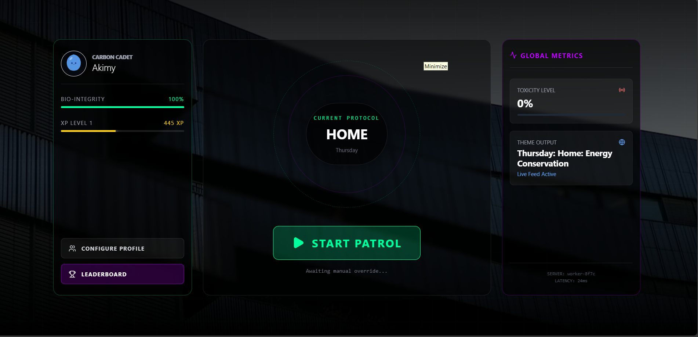
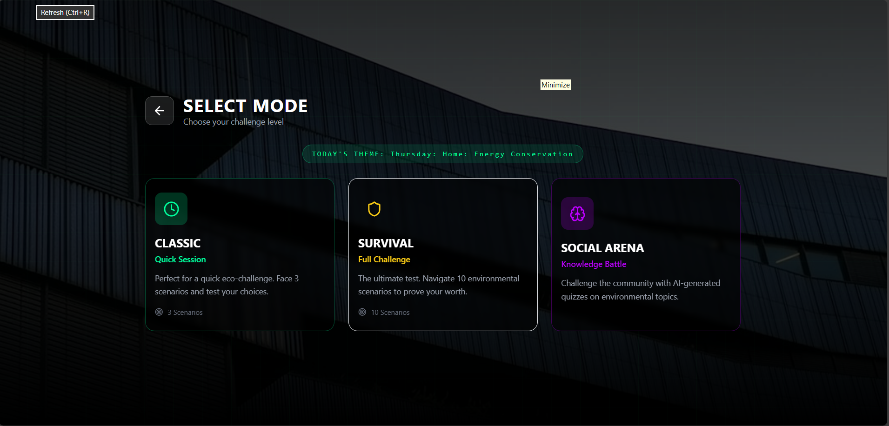
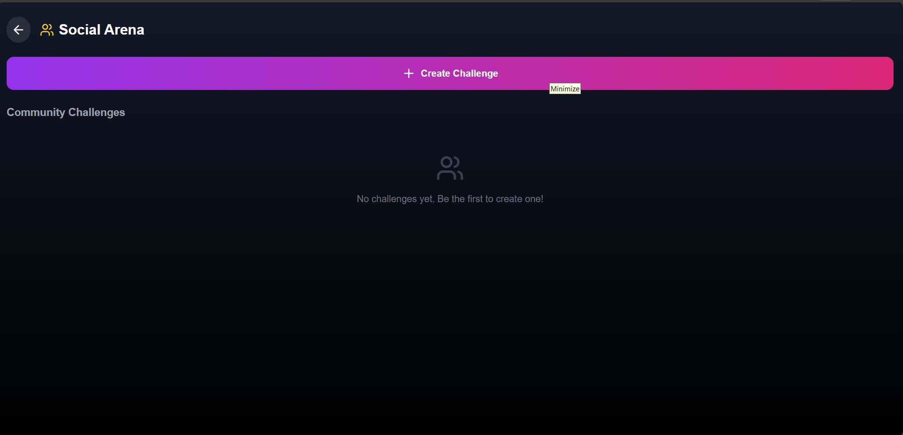

# 🌱 NanaSprout

> *"Small choices. Big planet. Play your part."*

## 🎯 What is NanaSprout?

NanaSprout is a gamified eco-education app that turns sustainability learning into an engaging adventure. Players face AI-generated environmental dilemmas, make real-world decisions, and compete on global leaderboards — all while learning how to reduce their carbon footprint.

## 📸 Screenshots

| Mission Hub | Gameplay | Profile |
|:-----------:|:--------:|:-------:|
|  |  |  |

## ✨ Key Features

- ✦ AI-powered dynamic scenarios that change daily
- ✦ Animated "Biosys Entity" spirit avatars (Ghibli-inspired!)
- ✦ Custom photo avatars with magical floating effects
- ✦ Real-time global leaderboards
- ✦ Eco-Operator ranking system (Carbon Cadet → Solar Sniper)
- ✦ Daily themed challenges (Food Waste Monday, Transport Tuesday, etc.)

## 🔗 Project Links

| 🌐 Live Demo | 📂 GitHub Repo |
|:------------:|:--------------:|
| [nana-sprout.vercel.app](https://nana-sprout.vercel.app/) | [github.com/Aminat202/NanaSprout](https://github.com/Aminat202/NanaSprout) |

## 🛠️ Built With

- ⚛️ React
- ⚡ Vite
- 🎨 Tailwind CSS
- ✨ Framer Motion
- 🗄️ Supabase
- 🤖 Cloudflare AI Workers
- 📷 Unsplash API

## 🚀 Getting Started

1. **Clone the repo**
   ```bash
   git clone https://github.com/Aminat202/NanaSprout.git
   cd NanaSprout
   ```

2. **Install dependencies**
   ```bash
   npm install
   ```

3. **Set up environment variables**
   ```bash
   cp .env.example .env
   # Add your Supabase and API keys
   ```

4. **Run the dev server**
   ```bash
   npm run dev
   ```

## 👩‍💻 Team

Built with 💚 by **Amina**

---

*NanaSprout © 2025 | Hackathon Submission*
